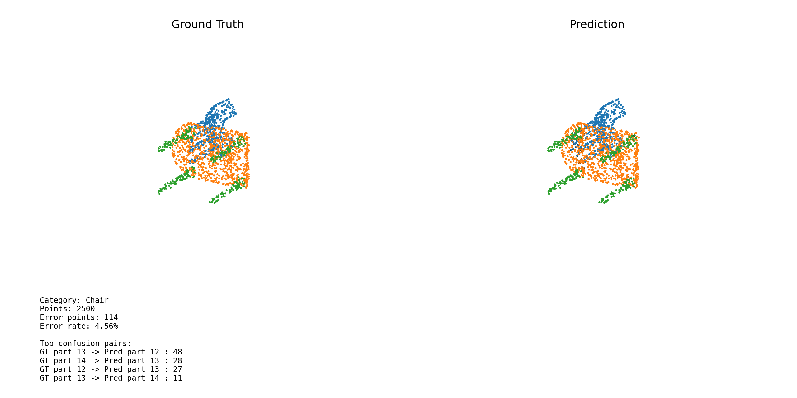
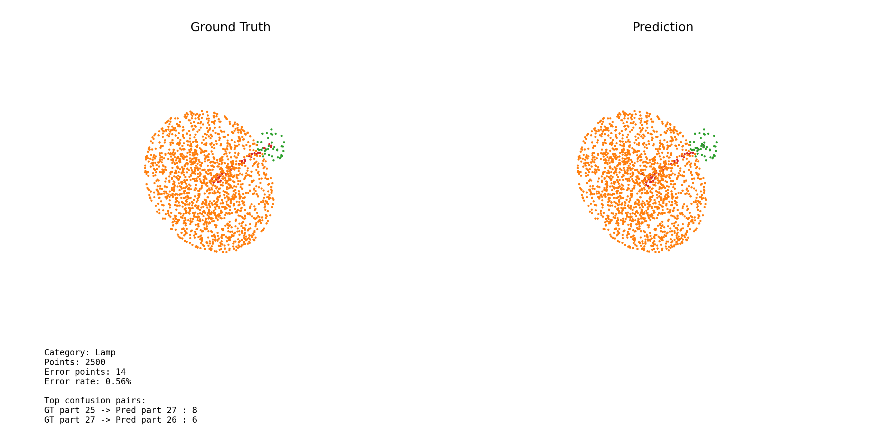
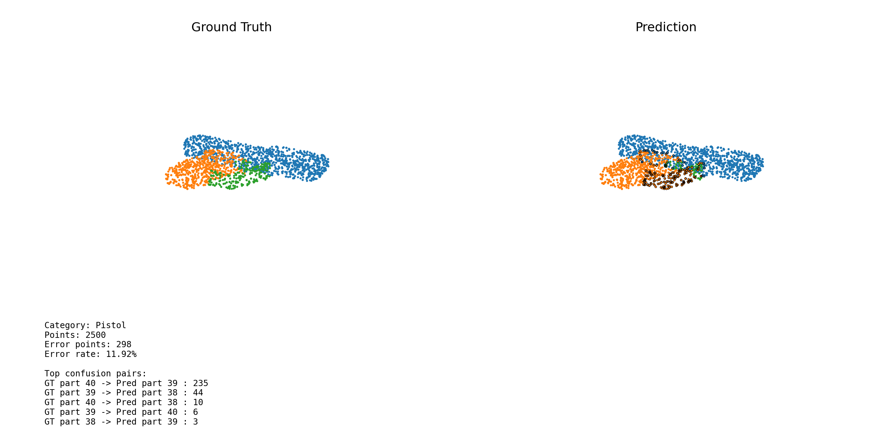

# PointNet ShapeNetPart 部件分割

基于 PyTorch 的 PointNet 复现实验，用于 ShapeNetPart 数据集上的三维点云部件分割。

本目录包含数据加载、模型定义、训练、测试、指标计算和可视化代码。实验使用点云坐标作为输入，为每个点预测一个部件类别，并通过 ShapeNetPart 的类别先验屏蔽无效部件标签。

## 结果摘要

| 指标 | 结果 |
| --- | ---: |
| 最佳验证集 mIoU | **0.8303** |
| 测试集 shape-level mIoU | **0.8017** |
| 测试集样本数 | **2874** |
| 训练轮数 | **25** |
| 每 batch 采样点数 | **2500** |

> 当前版本的评估脚本计算的是 shape-level mIoU，未计算测试集 loss 和逐点 accuracy。训练日志提供训练 loss，测试结果文件提供测试集 mIoU 和逐类别 mIoU。

## 任务定义

ShapeNetPart 部件分割是一个点云逐点分类任务：

- 输入：一个形状的 `N` 个三维点，形状为 `[B, 3, N]`
- 输出：每个点属于 50 个全局部件类别的 logits，形状为 `[B, N, 50]`
- 数据类别：16 个物体类别
- 部件类别：50 个全局部件类别
- 每个物体类别只允许预测属于该类别的合法部件

例如，Airplane 包含 4 个合法部件，Chair 包含 4 个合法部件，Motorbike 包含 6 个合法部件。模型输出经过类别掩码后，只保留当前物体类别允许的部件类别。

## 数据集

使用 ShapeNetPart normal benchmark，数据文件每行包含：

```text
x y z nx ny nz part_label
```

当前模型只读取 `x y z` 和 `part_label`，没有使用法向量 `nx ny nz`。

数据集划分如下：

| Split | 样本数 |
| --- | ---: |
| Train | 12137 |
| Validation | 1870 |
| Test | 2874 |

数据预处理和增强：

- 每个样本使用有放回采样，固定重采样到 2500 个点
- 点云坐标减去中心，并缩放到单位球范围
- 训练集随机绕 y 轴旋转
- 训练集添加标准差为 0.02 的高斯噪声
- 验证集和测试集不做数据增强
- 当前输入通道为 3，禁用 normals，因为现有 Input T-Net 是 `3 x 3`

数据集体积较大，不包含在 Git 仓库中。运行前需要将数据集放在 `segmentation` 目录下，目录结构如下：

```text
segmentation/
└── shapenetcore_partanno_segmentation_benchmark_v0_normal/
    ├── synsetoffset2category.txt
    ├── train_test_split/
    │   ├── shuffled_train_file_list.json
    │   ├── shuffled_val_file_list.json
    │   └── shuffled_test_file_list.json
    └── <synset_id>/
        └── <shape_id>.txt
```

## PyTorch 实现

核心模型定义在 `pointnet.py` 中，数据加载定义在 `shapenet_part_dataset.py` 中。

整体结构如下：

```text
Input Point Cloud
[B, 3, N]
        |
        v
Input T-Net
[B, 3, 3]
        |
        v
Shared MLP
3 -> 64 -> 64
        |
        v
Feature T-Net
[B, 64, 64]
        |
        +--------------------------+
        |                          |
        v                          v
Point Features [B, 64, N]     Shared MLP
                              64 -> 64 -> 128 -> 1024
                                       |
                                       v
                                  Max Pooling
                                       |
                                       v
                             Global Feature [B, 1024]
                                       |
                                       v
                         Repeat to N points [B, 1024, N]
                                       |
                                       v
                     Concatenate Point + Global Features
                              [B, 1088, N]
                                       |
                                       v
                              Segmentation MLP
                         1088 -> 512 -> 256 -> 128 -> 50
                                       |
                                       v
                              Per-point Predictions
                                   [B, N, 50]
```

### Input T-Net

Input T-Net 根据输入点云学习一个 `3 x 3` 变换矩阵，用于对输入坐标进行空间对齐。变换矩阵的初始输出被约束在单位矩阵附近。

### Feature T-Net

Feature T-Net 对第一组共享 MLP 得到的 64 维逐点特征学习 `64 x 64` 变换矩阵。训练时加入正交正则项，使变换矩阵接近正交矩阵。

### 共享 MLP

共享 MLP 使用 `Conv1d(kernel_size=1)` 实现，相当于对所有点使用同一组参数。编码器的主干为：

```text
3 -> 64 -> 64 -> 64 -> 128 -> 1024
```

其中 64 维逐点特征会被保留，用于后续分割头。

### 全局特征与逐点特征拼接

编码器对 1024 维特征沿点数维度做 max pooling，得到全局形状特征 `[B, 1024]`。该特征会复制到每个点，并与逐点 64 维特征拼接：

```text
Point feature:  [B, 64, N]
Global feature: [B, 1024, N]
Concatenated:   [B, 1088, N]
```

这样分割头既能看到局部点特征，也能看到全局形状上下文。

### 分割头

分割头使用四层逐点 MLP：

```text
1088 -> 512 -> 256 -> 128 -> 50
```

最终输出转置为 `[B, N, 50]`，再通过 CrossEntropyLoss 进行逐点分类训练。

### 类别掩码

ShapeNetPart 使用全局 0 到 49 的部件标签空间，并不是每个物体类别都包含全部 50 类。训练和测试时，代码根据当前物体类别构造合法部件掩码，把非法部件类别的 logits 设置为 `-1e9`，从而避免模型预测不属于该物体类别的部件。

## 损失函数

主损失为逐点交叉熵：

```text
L_ce = CrossEntropyLoss(logits, part_labels)
```

启用 Feature T-Net 时加入变换矩阵正交正则项：

```text
L_reg = mean(|| A * A^T - I ||_2)
L_total = L_ce + lambda * L_reg
```

实验中的正则权重为：

```text
lambda = 1e-3
```

## 训练配置

| 配置 | 数值 |
| --- | ---: |
| Epochs | 25 |
| Batch size | 16 |
| Points per sample | 2500 |
| Optimizer | Adam |
| Learning rate | 1e-3 |
| LR scheduler | StepLR |
| Step size | 20 |
| Gamma | 0.5 |
| Feature transform | Enabled |
| Feature transform weight | 1e-3 |
| Random seed | 42 |
| Model selection | Best validation mIoU |

训练每个 epoch 后计算验证集 mIoU。只有当验证集 mIoU 超过历史最优值时，才保存新的 checkpoint。

## 评估指标

当前实现报告 shape-level mean IoU。

对每个形状，先只计算该物体类别合法部件的 IoU：

```text
IoU(part) = intersection(predicted_part, target_part)
            / union(predicted_part, target_part)
```

然后对一个形状内的所有合法部件求平均，得到该形状的 IoU：

```text
shape_IoU = mean(IoU(part_1), ..., IoU(part_K))
```

最后对所有测试形状求平均：

```text
mIoU = mean(shape_IoU_1, ..., shape_IoU_S)
```

实现遵循参考流程：当某个部件的预测和真实标签并集为空时，该部件的 IoU 记为 1。


## 实验结果

测试集总体结果保存在 `segmentation_out/test_metrics.json` 中：

| 指标 | 结果 |
| --- | ---: |
| Best validation mIoU | 0.8303 |
| Test shape-level mIoU | 0.8017 |
| Test shapes | 2874 |

### 训练日志

终端日志中可用的 epoch 记录从第 12 轮开始：

| Epoch | Train Loss | Validation mIoU |
| ---: | ---: | ---: |
| 12 | 0.2500 | 0.7997 |
| 13 | 0.2500 | 0.8004 |
| 14 | 0.2395 | 0.8043 |
| 15 | 0.2355 | 0.8028 |
| 16 | 0.2318 | 0.8132 |
| 17 | 0.2295 | 0.8052 |
| 18 | 0.2272 | 0.8138 |
| 19 | 0.2244 | 0.8162 |
| 20 | 0.2218 | 0.8219 |
| 21 | 0.2072 | 0.8295 |
| 22 | 0.2039 | **0.8303** |
| 23 | 0.2014 | 0.8184 |
| 24 | 0.1994 | 0.8219 |
| 25 | 0.1983 | 0.8266 |

训练 loss 随 epoch 增加整体下降，验证集 mIoU 在第 22 轮达到最佳值 0.8303。

### 逐类别测试结果

| Category | Test mIoU |
| --- | ---: |
| Airplane | 0.7682 |
| Bag | 0.7416 |
| Cap | 0.7228 |
| Car | 0.6267 |
| Chair | 0.8752 |
| Earphone | 0.7068 |
| Guitar | 0.8774 |
| Knife | 0.8269 |
| Lamp | 0.7636 |
| Laptop | 0.9439 |
| Motorbike | 0.5669 |
| Mug | 0.8463 |
| Pistol | 0.7518 |
| Rocket | 0.4624 |
| Skateboard | 0.6159 |
| Table | 0.7992 |

Laptop、Guitar、Chair 和 Mug 的结果相对较高。Rocket、Motorbike、Skateboard 和 Car 的结果相对较低，说明具有细长、薄小、结构可变或内部部件边界不明显的物体仍然较难分割。

## 可视化对比

可视化脚本会生成两个并排的三维点云：

- 左侧：Ground Truth
- 右侧：Prediction
- 颜色表示部件类别
- 黑色轮廓表示预测错误的点
- 底部显示物体类别、错误点数量、错误率和主要混淆部件

### Chair



### Lamp



### Pistol



这些样例同时包含较准确的预测和局部错误。错误通常集中在部件边界、结构连接处或视觉上相似的相邻部件。


