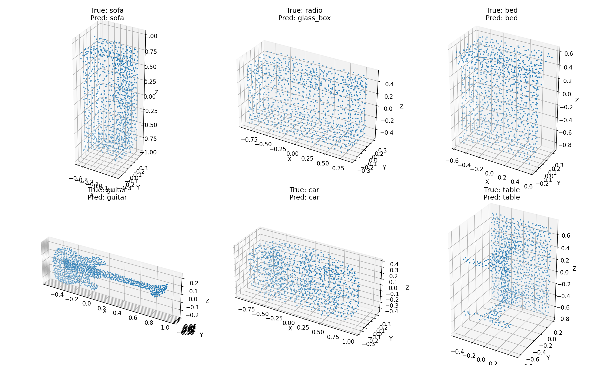

# PointNet-ModelNet40-PyTorch

A PyTorch implementation of PointNet for 3D object classification on the ModelNet40 dataset.

## Overview

This project reproduces the PointNet classification architecture using PyTorch and trains it on the ModelNet40 3D point cloud dataset.

Unlike the MNIST experiment, ModelNet40 contains real 3D point cloud data. Each object is represented by a set of 3D points:

```text
(x, y, z)
```

The PointNet network directly processes unordered point sets and predicts one of 40 object categories.

## PointNet Architecture

The implemented PointNet classification pipeline is:

```text
Input Point Cloud
[B, 3, N]
      |
      v
Input T-Net
[B, 3, 3]
      |
      v
Shared MLP
3 -> 64 -> 64
      |
      v
Feature T-Net
[B, 64, 64]
      |
      v
Shared MLP
64 -> 64 -> 128 -> 1024
      |
      v
Max Pooling
      |
      v
Global Feature
[B, 1024]
      |
      v
Fully Connected Layers
1024 -> 512 -> 256 -> 40
      |
      v
40-class Prediction
```

The implementation includes:

- Input Transform Network (3x3 T-Net)
- Feature Transform Network (64x64 T-Net)
- Shared MLP implemented using Conv1d
- Batch Normalization
- Symmetric max pooling
- Feature transform regularization
- Fully connected classification network

## Dataset

Dataset: ModelNet40

Training samples:

```text
9840
```

Test samples:

```text
2468
```

Original point cloud shape:

```text
[2048, 3]
```

The 40 categories include objects such as:

```text
airplane
bed
car
chair
guitar
radio
sofa
table
...
```

The dataset files are not included in this repository because of their size.

Expected dataset directory:

```text
data/
└── modelnet40_ply_hdf5_2048/
    ├── ply_data_train0.h5
    ├── ply_data_train1.h5
    ├── ply_data_train2.h5
    ├── ply_data_train3.h5
    ├── ply_data_train4.h5
    ├── ply_data_test0.h5
    └── ply_data_test1.h5
```

## Training Configuration

The experiment was trained using:

```text
GPU: NVIDIA GeForce RTX 4090
PyTorch: 2.3.0
CUDA: 12.1
Epochs: 20
Initial Learning Rate: 0.001
Optimizer: Adam
```

Learning rate was reduced during training:

```text
Epoch 1-10:  0.001
Epoch 11-20: 0.0005
```

## Training Results

Final epoch:

```text
Epoch 20/20

Train Loss:     0.2859
Train Accuracy: 90.75%
Test Accuracy:  87.12%
```

Best test result:

```text
Best Test Accuracy: 87.32%
```

The best result occurred at epoch 19.

Test evaluation of the saved best model:

```text
Correct: 2155
Total:   2468

Test Accuracy: 87.32%
```

## Prediction Examples

The test script randomly selects ModelNet40 samples and compares the true category with the PointNet prediction.

Example:

```text
True = sofa
Pred = sofa

True = radio
Pred = glass_box

True = bed
Pred = bed

True = guitar
Pred = guitar

True = car
Pred = car

True = table
Pred = table
```

Prediction visualization:



## Project Structure

```text
PointNet-ModelNet40-PyTorch/
├── pointnet.py
├── modelnet40_dataset.py
├── train_modelnet40.py
├── test_modelnet40.py
├── modelnet40_predictions.png
├── README.md
└── .gitignore
```

### pointnet.py

Contains the PointNet neural network implementation:

- TNet
- PointNetEncoder
- PointNetClassifier
- Feature transform regularizer

### modelnet40_dataset.py

Loads and preprocesses the ModelNet40 HDF5 point cloud dataset.

### train_modelnet40.py

Trains PointNet on ModelNet40.

The script performs:

```text
Dataset
   ↓
DataLoader
   ↓
PointNet Forward
   ↓
Cross Entropy Loss
   ↓
Feature Transform Regularization
   ↓
Backward Propagation
   ↓
Adam Optimizer
   ↓
Model Evaluation
   ↓
Save Best Model
```

### test_modelnet40.py

Loads the best trained model and evaluates it on the ModelNet40 test set.

It also randomly selects samples and visualizes their 3D point clouds together with true and predicted labels.

## Run Training

```bash
python train_modelnet40.py
```

The best model will be saved as:

```text
best_pointnet_modelnet40.pth
```

## Run Testing

After training:

```bash
python test_modelnet40.py
```

The prediction visualization will be saved as:

```text
modelnet40_predictions.png
```

## Result

The PointNet implementation achieved:

```text
87.32% test accuracy
```

on the ModelNet40 test set.

This experiment demonstrates the complete PointNet pipeline for real 3D point cloud classification using PyTorch.