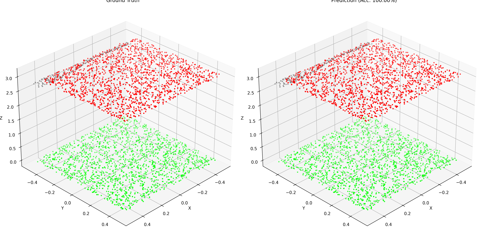

# PointNet-S3DIS-PyTorch

PyTorch implementation of **PointNet** for semantic segmentation on the **S3DIS** indoor 3D point cloud dataset.

This project trains PointNet to classify each point in an indoor scene into one of 13 semantic categories.

---

## Dataset

Dataset: **S3DIS (Stanford Large-Scale 3D Indoor Spaces)**

Preprocessed HDF5 version:

```text
indoor3d_sem_seg_hdf5_data
```

Dataset information:

```text
Total samples:    23585
Points/sample:    4096
Features/point:   9
Semantic classes: 13
```

Input and label shapes:

```text
data  : (23585, 4096, 9)
label : (23585, 4096)
```

### Dataset Split

**Area 5** is used as the test set.

```text
Training samples: 16733
Testing samples:   6852
```

The 13 semantic classes are:

```text
ceiling, floor, wall, beam, column,
window, door, table, chair, sofa,
bookcase, board, clutter
```

---

## Environment

Training environment:

```text
GPU: NVIDIA GeForce RTX 4090
Framework: PyTorch
CUDA: GPU acceleration
Python: 3.10
```

Main dependencies:

```text
torch
numpy
h5py
matplotlib
```

Install dependencies:

```bash
pip install torch numpy h5py matplotlib
```

---

## Project Structure

```text
PointNet-S3DIS-PyTorch/
│
├── dataset.py
├── pointnet_seg.py
├── train_s3dis.py
├── test_s3dis.py
├── visualize_s3dis.py
├── s3dis_comparison.png
├── README.md
└── models/
```

### Files

- `dataset.py` — loads and splits the S3DIS HDF5 dataset
- `pointnet_seg.py` — PointNet semantic segmentation model
- `train_s3dis.py` — model training
- `test_s3dis.py` — evaluation and IoU calculation
- `visualize_s3dis.py` — visualization of segmentation results

---

## Training Configuration

```text
Model:           PointNet
Task:            Semantic Segmentation
Dataset:         S3DIS
Test Area:       Area 5

Batch Size:      16
Epochs:          10
Learning Rate:   0.001
Optimizer:       Adam
Loss:            Cross Entropy
Regularization:  Feature Transform Regularization
```

Model input:

```text
[B, 9, 4096]
```

Model output:

```text
[B, 13, 4096]
```

---

## Training

Run:

```bash
python train_s3dis.py
```

Training started with:

```text
Train samples: 16733
Test samples: 6852

Train batches: 1045
Test batches: 429
```

### Training Log

| Epoch | Train Loss | Train Accuracy | Test Loss | Test Accuracy |
|------:|-----------:|---------------:|----------:|--------------:|
| 1 | 0.8972 | 71.98% | 0.7456 | 75.72% |
| 2 | 0.6763 | 78.04% | 0.8154 | 75.74% |
| 3 | 0.5800 | 80.92% | 0.7485 | 76.59% |
| 4 | 0.5160 | 82.91% | 1.1663 | 61.95% |
| 5 | 0.4676 | 84.45% | 0.6651 | 79.43% |
| 6 | 0.4474 | 85.04% | 0.6565 | 79.28% |
| 7 | 0.4098 | 86.26% | 0.7565 | 78.21% |
| 8 | 0.3803 | 87.18% | 0.7416 | 77.51% |
| 9 | 0.3742 | 87.35% | 0.9281 | 76.83% |
| 10 | 0.3705 | 87.46% | 0.6557 | **81.07%** |

Best model:

```text
models/best_pointnet_s3dis.pth
```

---

## Test Results

Run:

```bash
python test_s3dis.py
```

Final Area 5 results:

```text
Overall Accuracy:     81.07%
Mean Class Accuracy:  51.71%
Mean IoU:             40.46%
```

### Per-Class IoU

| Class | IoU |
|---|---:|
| ceiling | 89.37% |
| floor | 96.12% |
| wall | 68.97% |
| beam | 0.00% |
| column | 0.84% |
| window | 39.05% |
| door | 9.59% |
| table | 57.46% |
| chair | 50.26% |
| sofa | 13.27% |
| bookcase | 37.43% |
| board | 25.37% |
| clutter | 38.18% |

---

## Visualization

Run:

```bash
python visualize_s3dis.py
```

The script compares the **Ground Truth** segmentation with the **PointNet Prediction**.

### Ground Truth vs Prediction



Different colors represent different semantic classes.

Example visualization output:

```text
Sample Accuracy: 100.00%

Ground Truth classes:
ceiling
floor
clutter

Predicted classes:
ceiling
floor
clutter
```

---

## Results Summary

After training PointNet for **10 epochs** on S3DIS:

```text
Train Accuracy:       87.46%
Overall Accuracy:     81.07%
Mean Class Accuracy:  51.71%
Mean IoU:             40.46%
```

The model performs especially well on large indoor structures such as:

```text
floor
ceiling
wall
```

while smaller or less frequent classes such as `beam`, `column`, and `door` are more difficult to segment.

---

## Usage

Train:

```bash
python train_s3dis.py
```

Test:

```bash
python test_s3dis.py
```

Visualize:

```bash
python visualize_s3dis.py
```
